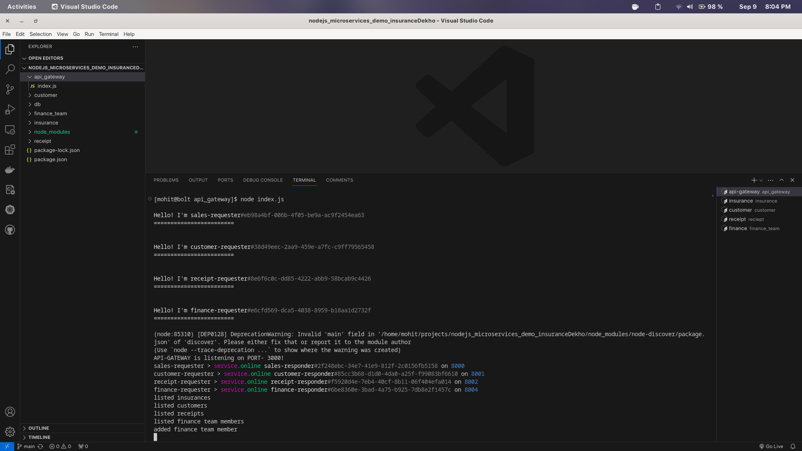

# liveInventory

A simple insurance management application backend using micro-services architecture. 

## Functional Requirements
- Users can view all insurances.
- Users can view all customers.
- Users can view all receipts.
- Users can view all finance team members.
- Users can add a new insurance.

## Non Functional Requirements
- customer should not be added to the db until the new insurance is added in the sales_db.
- receipt should not be generated until the customer is added to customer_db.
- Upon a sucessful receipt generation, the finance team should immediately get alert via PUB-SUB.

## Design
- **Low Level Design:** 
    - insurance data model:
        - agent : 'name of the agent'
        - customer : 'name of the customer'
        - tenure : 'number of years of the insurance'

    - customer data model:
        - name : 'name of the customer'
    
    - receipt data model:
        - receipt : 'msg of the receipt'

    - finance team member data model:
        - name : 'name of the team member'
    
- **Hight Level Design:** The application is built using micro-services architecture in which all the services including API Gateway is built on NodeJS, MongoDB is used as database and Cote is used to connect zero configuration micro-services.

## Architecture
    

## Working
On a POST req from client with new Insurance info data as JSON req-body, the api-gateway first connects with insurance-service to add this new insurance to the sales-db, only after a successful transaction, the api-gateway then requests the customer-service to add this new customer to it's db. After this, the api-gateway then requests the receipts-service to generate and return a new receipt of this insurance which is then transmitted back to the client.
Also, as soon as the receipt is generated, the finance-service which has a subsciber listening to a publisher of the receipts-service, triggers an alert for all the finance team members from it's finance-db about this new customer mentioning his/her name.

## Technical
Cote library supports units - Requester, Responder, Publisher and Subsriber. These objects listens to all initiated requests and accepts those which match their 'key'. This abstracts the whole overhead of configuring message-brokers like kafka and rabbitmq. 
Each event emmitter can make different kind of requests to the same listener based on the request 'type'. Event listeners can respond differently based on this parameter which is attached to each request.

## Screenshots
All five services running:
    
    
    
    
    

Get requests to insurance, customers, receipts and finance service:
    
    
    
    

Get request events on api-gateway console:
    

Add a new finance team member with finance-service and logs on api-gateway console:
    
    

Add a new insurance and event logging on api-gateway and alerts generated in finance-service:
    
    
    

Final response from insurance, customer and receipts service:
    
    
    